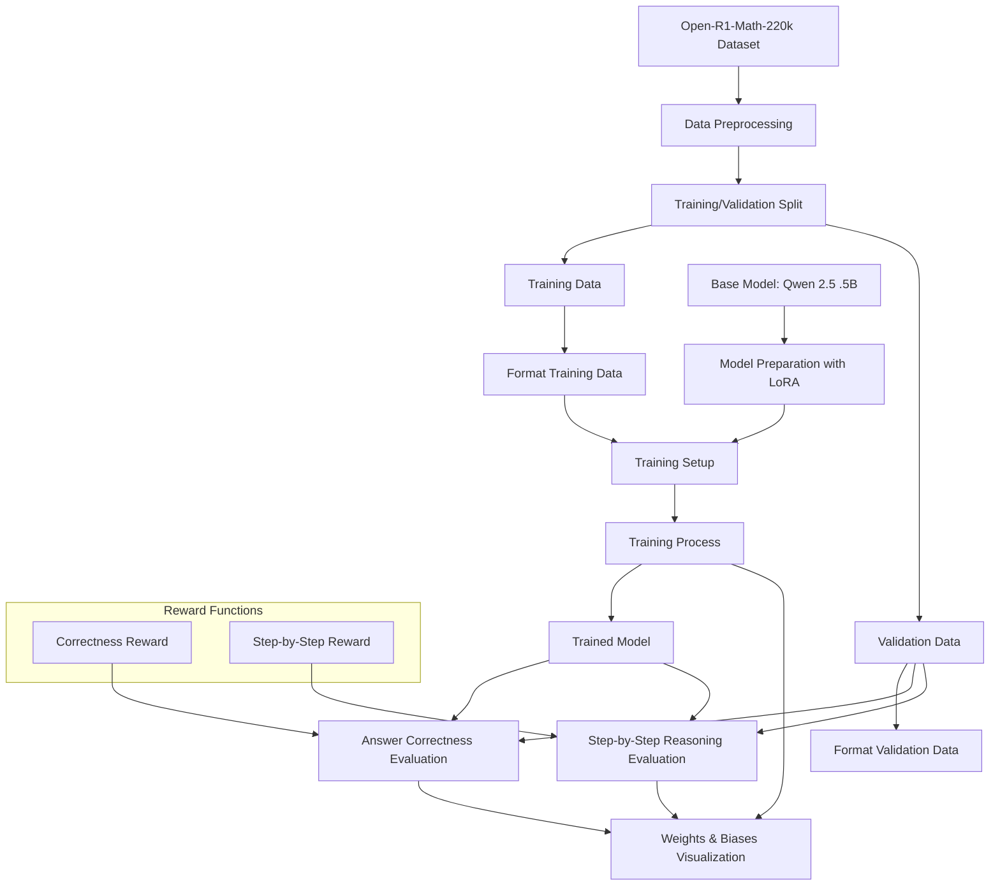

# Open-R1-Math-220k Fine-tuning Project

## Project Overview

This project aims to fine-tune a small language model (based on Qwen 2.5 .5B distilled) on the Open-R1-Math-220k dataset for mathematical reasoning. We're building on previous work that used GSM8K, now leveraging a much larger synthetic dataset (220k examples vs. ~8k) to test how well small models can retain knowledge and reason through complex problems.

## Key Idea

The Open-R1-Math-220k dataset is a high-quality, synthetic dataset designed for training reasoning models. It's significantly larger than GSM8K (220k vs. ~8k) and has been filtered to maintain a high level of correctness and clarity. This makes it an excellent candidate for continued fine-tuning of our existing model.

We're not starting from scratch; we're building on the existing model's knowledge which started as the Qwen 2.5 .5B distilled version. This project tests what models retain from one training to the next and how small of a model can be effectively trained to reason through complex problem solving.

## Pipeline Overview

Our fine-tuning pipeline consists of the following key stages:

1. **Dataset Loading**: Load the Open-R1-Math-220k dataset using the Hugging Face datasets library
2. **Data Preprocessing**: Extract problems, solutions, and answers from the dataset and create training/validation splits
3. **Answer Extraction & Reward Functions**: Implement functions to extract and compare answers, and evaluate step-by-step reasoning
4. **Model Loading**: Load the base model (Qwen 2.5 .5B) and tokenizer
5. **Model Preparation**: Prepare the model for training with LoRA (Low-Rank Adaptation)
6. **Training Data Preparation**: Format the training data with prompts and solutions
7. **Training Setup**: Configure training arguments and set up the trainer
8. **Training**: Train the model using the prepared data
9. **Evaluation**: Evaluate the model on the validation set for answer correctness and reasoning quality
10. **Visualization**: Log metrics to Weights & Biases for visualization

## Pipeline Flow Diagram



## Implementation Steps

### 1. Dataset Loading and Exploration

```python
from datasets import load_dataset

# Load the dataset
openr1_dataset = load_dataset("open-r1/OpenR1-Math-220k")

# Inspect structure
print(openr1_dataset)
print(openr1_dataset['train'][0])  # Examine a sample

# Check dataset size
print(f"Training examples: {len(openr1_dataset['train'])}")
if 'validation' in openr1_dataset:
    print(f"Validation examples: {len(openr1_dataset['validation'])}")
```

**Implementation Notes:**
- Verify that the dataset has the expected structure with "problem", "solution", and "answer" fields
- Examine several examples to understand the format of questions and answers
- Check if there's a validation split; if not, you'll need to create one

### 2. Data Preprocessing

```python
def preprocess_dataset(dataset, split="train"):
    """Extract problems, solutions, and answers from the dataset."""
    problems = []
    solutions = []
    answers = []
    
    for example in dataset[split]:
        problem = example["problem"]
        solution = example["solution"]
        answer = example["answer"]
        
        problems.append(problem)
        solutions.append(solution)
        answers.append(answer)
    
    return problems, solutions, answers

def create_train_val_split(dataset):
    """Create training and validation splits from the dataset."""
    # Process training data
    train_problems, train_solutions, train_answers = preprocess_dataset(dataset, "train")
    
    # Process validation data (if available)
    if 'validation' in dataset:
        val_problems, val_solutions, val_answers = preprocess_dataset(dataset, "validation")
    else:
        # Create a validation split if not available
        train_problems, val_problems, train_solutions, val_solutions, train_answers, val_answers = train_test_split(
            train_problems, train_solutions, train_answers, test_size=0.1, random_state=42
        )
    
    return (
        train_problems, train_solutions, train_answers,
        val_problems, val_solutions, val_answers
    )
```

**Implementation Notes:**
- The function extracts problems, solutions, and answers from the dataset
- If no validation split exists, create one using train_test_split

### 3. Answer Extraction and Reward Functions

```python
def extract_openr1_answer(generated_text):
    """Extract the answer from the generated text."""
    # Check for "The answer is:" format
    answer_pattern = r'The answer is:?\s*(.*?)(?:\n|$)'
    match = re.search(answer_pattern, generated_text, re.IGNORECASE)
    if match:
        return match.group(1).strip()
    
    # Check if the text already contains a formatted answer like v_{R}=4
    var_pattern = r'v_\{[^}]+\}\s*=\s*\d+'
    if re.search(var_pattern, generated_text):
        return generated_text.strip()
    
    # Try to extract from LaTeX format (common in math problems)
    latex_patterns = [
        r'=\s*(\d+(?:\.\d+)?)',  # Match = number (possibly with decimal)
        r'(\d+(?:\.\d+)?)\s*$'   # Match number at the end of text
    ]
    
    for pattern in latex_patterns:
        match = re.search(pattern, generated_text)
        if match:
            return match.group(1).strip()
    
    # Try to extract from XML tags if present
    match = re.search(r"<answer>\s*(.*?)\s*</answer>", generated_text, re.DOTALL)
    if match:
        return match.group(1).strip()
    
    # If no pattern matches, return the last line as a fallback
    lines = generated_text.strip().split('\n')
    return lines[-1].strip()

def normalize_answer(answer):
    """Normalize an answer for comparison."""
    # For simple numeric answers
    if re.match(r'^\s*\d+(?:\.\d+)?\s*$', answer):
        return answer.strip()
    
    # For complex answers with variables, extract all numbers
    numbers = re.findall(r'=\s*(\d+(?:\.\d+)?)', answer)
    if numbers:
        return ','.join(numbers)
    
    # Remove LaTeX formatting as a fallback
    answer = re.sub(r'\\mathrm\{[^}]*\}', '', answer)
    answer = re.sub(r'\\', '', answer)
    answer = re.sub(r'\{|\}', '', answer)
    
    return answer.strip()

def compare_answers(generated, reference):
    """Compare a generated answer with a reference answer."""
    generated_norm = normalize_answer(generated)
    reference_norm = normalize_answer(reference)
    
    # If both contain multiple numbers (like v_R=4, v_B=10)
    gen_numbers = re.findall(r'\d+(?:\.\d+)?', generated_norm)
    ref_numbers = re.findall(r'\d+(?:\.\d+)?', reference_norm)
    
    if len(gen_numbers) > 1 and len(ref_numbers) > 1:
        # Check if all numbers match (order-independent)
        return sorted(gen_numbers) == sorted(ref_numbers)
    
    # Try numeric comparison for single numbers
    try:
        gen_float = float(generated_norm)
        ref_float = float(reference_norm)
        return math.isclose(gen_float, ref_float, rel_tol=1e-8)
    except (ValueError, TypeError):
        # Fall back to string comparison
        return generated_norm == reference_norm

def correctness_reward_func(generated_texts, reference_answers):
    """Calculate correctness rewards for generated answers."""
    rewards = []
    for gen_text, ref_answer in zip(generated_texts, reference_answers):
        extracted_answer = extract_openr1_answer(gen_text)
        if compare_answers(extracted_answer, ref_answer):
            rewards.append(1.0)
        else:
            rewards.append(0.0)
    return rewards

def step_by_step_reward_func(generated_texts, reference_solutions):
    """Calculate rewards for step-by-step reasoning."""
    rewards = []
    for gen_text, ref_solution in zip(generated_texts, reference_solutions):
        # Count the number of steps (lines) in the solution
        gen_steps = len([line for line in gen_text.split('\n') if line.strip()])
        ref_steps = len([line for line in ref_solution.split('\n') if line.strip()])
        
        # Calculate a simple ratio of steps
        step_ratio = min(gen_steps / max(1, ref_steps), 1.0)
        
        # Check if key equations are present
        key_equations = re.findall(r'\\begin\{array\}.*?\\end\{array\}', ref_solution, re.DOTALL)
        equation_score = 0.0
        if key_equations:
            for eq in key_equations:
                if eq in gen_text:
                    equation_score += 1.0 / len(key_equations)
        else:
            # If no equations found, look for mathematical expressions
            math_expressions = re.findall(r'\$.*?\$', ref_solution)
            if math_expressions:
                for expr in math_expressions:
                    if expr in gen_text:
                        equation_score += 1.0 / len(math_expressions)
            else:
                # If no math expressions found, give full score for this part
                equation_score = 1.0
        
        # Combine scores (50% for steps, 50% for equations)
        combined_score = 0.5 * step_ratio + 0.5 * equation_score
        rewards.append(combined_score)
    
    return rewards
```

**Implementation Notes:**
- The extraction function handles various answer formats including "The answer is:", LaTeX formatting, variable-based answers, XML tags, and last line extraction
- The normalization function standardizes answers for comparison
- The comparison function handles multiple numbers in answers, performs numeric comparison with tolerance, and falls back to string comparison when needed
- The step-by-step reward function evaluates reasoning quality based on step count and equation presence

### 4. Model Loading and Training Setup

```python
def load_model_and_tokenizer(model_name="Qwen/Qwen2.5-0.5B"):
    """Load the base model and tokenizer."""
    tokenizer = AutoTokenizer.from_pretrained(model_name)
    model = AutoModelForCausalLM.from_pretrained(
        model_name,
        torch_dtype=torch.float16,
        device_map="auto"
    )
    
    # Configure the tokenizer for the model
    tokenizer.pad_token = tokenizer.eos_token
    
    return model, tokenizer

def prepare_model_for_training(model):
    """Prepare the model for training with LoRA."""
    # Configure LoRA
    lora_config = LoraConfig(
        r=16,
        lora_alpha=32,
        target_modules=["q_proj", "k_proj", "v_proj", "o_proj"],
        lora_dropout=0.05,
        bias="none",
        task_type="CAUSAL_LM"
    )
    
    # Prepare model for k-bit training if using quantization
    model = prepare_model_for_kbit_training(model)
    
    # Get PEFT model
    model = get_peft_model(model, lora_config)
    
    return model

def setup_training_arguments(output_dir="./results"):
    """Set up training arguments."""
    return TrainingArguments(
        output_dir=output_dir,
        num_train_epochs=1,  # Start with one epoch
        per_device_train_batch_size=1,
        gradient_accumulation_steps=4,  # Adjust based on GPU memory
        learning_rate=1e-6,  # Lower learning rate for continued fine-tuning
        weight_decay=0.01,
        logging_dir="./logs",
        logging_steps=10,
        evaluation_strategy="steps",
        eval_steps=100,
        save_strategy="steps",
        save_steps=100,
        load_best_model_at_end=True,
        metric_for_best_model="eval_loss",
        fp16=True,  # Use mixed precision training
        report_to="wandb",  # Enable Weights & Biases reporting
    )
```

**Implementation Notes:**
- The model is loaded with float16 precision to reduce memory usage
- LoRA is used for efficient fine-tuning with fewer parameters
- Training arguments are configured for regular evaluation and logging to Weights & Biases

### 5. Training Data Preparation

```python
def format_prompt(problem):
    """Format the prompt for the model."""
    return f"""Solve the following mathematical problem step by step. After solving, clearly state the final answer.

Problem: {problem}

Solution:"""

def prepare_training_data(problems, solutions, answers, tokenizer):
    """Prepare the training data for the model."""
    training_data = []
    
    for problem, solution, answer in zip(problems, solutions, answers):
        prompt = format_prompt(problem)
        
        # Format the full solution with a clear answer at the end
        if "The answer is" not in solution and "the answer is" not in solution.lower():
            full_solution = solution + f"\n\nThe answer is: {answer}"
        else:
            full_solution = solution
        
        # Combine prompt and solution for causal language modeling
        full_text = prompt + " " + full_solution
        
        # Tokenize the full text
        tokenized = tokenizer(full_text, return_tensors="pt", padding=False, truncation=True, max_length=1024)
        
        # Create input_ids and attention_mask
        input_ids = tokenized.input_ids[0]
        attention_mask = tokenized.attention_mask[0]
        
        # For causal LM, labels are the same as input_ids
        labels = input_ids.clone()
        
        # Set prompt tokens to -100 so they're not included in loss calculation
        prompt_tokens = tokenizer(prompt, return_tensors="pt").input_ids[0]
        prompt_length = len(prompt_tokens)
        labels[:prompt_length] = -100
        
        training_data.append({
            "input_ids": input_ids,
            "attention_mask": attention_mask,
            "labels": labels
        })
    
    return training_data
```

**Implementation Notes:**
- The prompt format encourages step-by-step reasoning and a clear final answer
- The training data preparation ensures consistent formatting with "The answer is:" if not already present
- Prompt tokens are masked in the labels to exclude them from loss calculation

### 6. Training and Evaluation

```python
# Set up trainer
trainer = Trainer(
    model=model,
    args=training_args,
    train_dataset=train_data,
    eval_dataset=val_data,
)

# Add wandb callback for metric logging
if wandb_initialized:
    trainer.add_callback(WandbCallback(trainer))

# Start training
trainer.train()

# Save the model
trainer.save_model("./openr1_finetuned_model")

# Evaluate on validation set
accuracy = evaluate_model(model, tokenizer, val_problems, val_answers, num_examples=20)

# Evaluate step-by-step reasoning
reasoning_score = evaluate_step_by_step_reasoning(model, tokenizer, val_problems, val_solutions, num_examples=5)

# Log final metrics to wandb
if wandb_initialized:
    wandb.log({
        "final_accuracy": accuracy,
        "final_reasoning_score": reasoning_score
    })
```

**Implementation Notes:**
- The trainer is set up with the prepared model, training arguments, and datasets
- A custom callback is added for logging metrics to Weights & Biases
- The model is evaluated on both answer correctness and reasoning quality
- Final metrics are logged to Weights & Biases for visualization

## Weights & Biases Integration

The pipeline integrates with Weights & Biases for experiment tracking and visualization:

1. **Initialization**: The wandb project is initialized with configuration parameters
2. **Training Metrics**: Training loss and other metrics are logged during training
3. **Custom Callback**: A custom callback logs additional metrics at each step
4. **Final Metrics**: Answer accuracy and reasoning quality scores are logged at the end
5. **Visualization**: All metrics can be visualized in the Weights & Biases dashboard

## Getting Started

1. Clone this repository
2. Install the required dependencies:
   ```bash
   pip install -r requirements.txt
   ```
3. Run a small-scale test:
   ```bash
   python train_openr1_small.py
   ```
4. Run the full training pipeline:
   ```bash
   python openr1_finetuning.py
   ```

## Additional Considerations

1. **Dataset Size Management**: The full dataset is large (220k examples). Consider starting with a subset for initial testing.

2. **Hyperparameter Tuning**: Experiment with different learning rates, training epochs, and reward weights.

3. **Format Consistency**: If the Open-R1 dataset has consistent formatting, you may be able to simplify or remove some format-related rewards.

4. **Memory Management**: Be mindful of GPU memory usage, especially with a large dataset.

5. **Incremental Testing**: Test each component thoroughly before running the full training pipeline.
