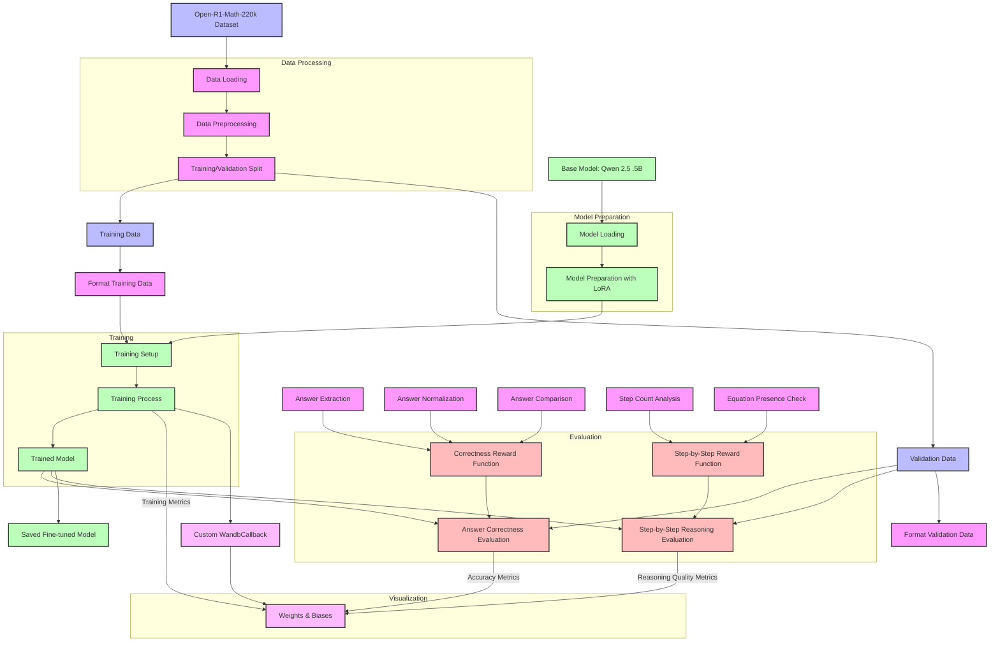

# OpenR1 Fine-tuning Pipeline Diagram

The following diagram illustrates the complete pipeline for fine-tuning the OpenR1 model on the Open-R1-Math-220k dataset, from data loading to visualization in Weights & Biases.

## Pipeline Stages

1. **Data Processing**
   - Load the Open-R1-Math-220k dataset
   - Preprocess the data to extract problems, solutions, and answers
   - Create training and validation splits

2. **Model Preparation**
   - Load the base Qwen 2.5 .5B model and tokenizer
   - Prepare the model for training with LoRA (Low-Rank Adaptation)
   - Configure the model for efficient fine-tuning

3. **Training**
   - Format the training and validation data with prompts and solutions
   - Set up training arguments and the trainer
   - Train the model using the prepared data
   - Save the fine-tuned model

4. **Evaluation**
   - Evaluate answer correctness using extraction and comparison functions
   - Evaluate step-by-step reasoning quality
   - Calculate metrics for model performance

5. **Visualization**
   - Initialize Weights & Biases for experiment tracking
   - Log training metrics during the training process
   - Log final evaluation metrics
   - Visualize all metrics in the Weights & Biases dashboard

## Key Components

- **Reward Functions**: Functions that evaluate the model's outputs
  - Correctness reward: Evaluates if the extracted answer matches the reference
  - Step-by-step reward: Evaluates the quality of the reasoning process

- **Answer Processing**:
  - Extraction: Extract answers from generated text
  - Normalization: Standardize answers for comparison
  - Comparison: Compare generated answers with reference answers

- **Weights & Biases Integration**:
  - Custom callback for logging metrics
  - Real-time visualization of training progress
  - Final performance metrics dashboard
